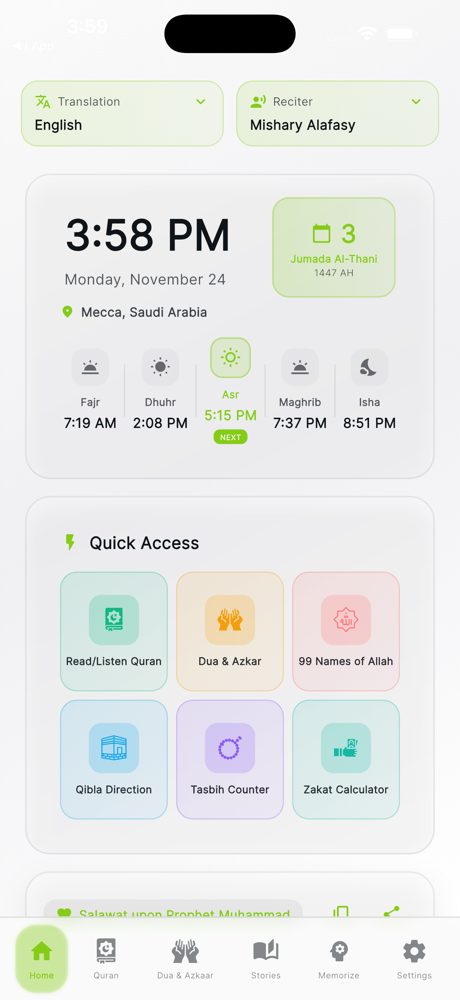
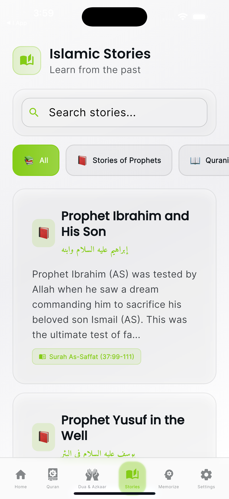
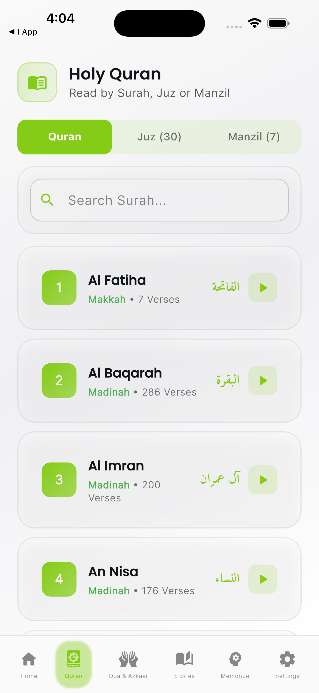
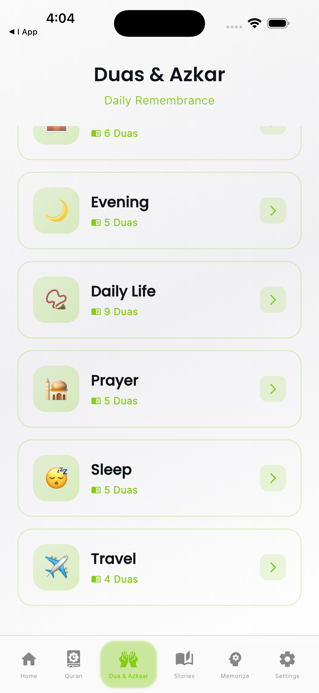
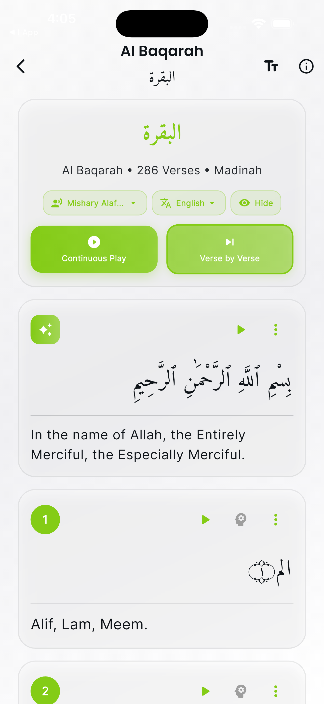
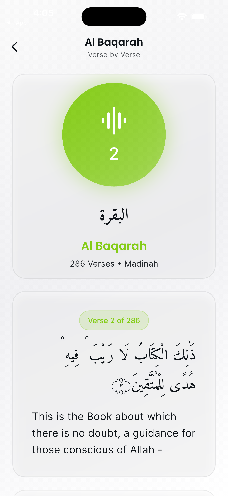
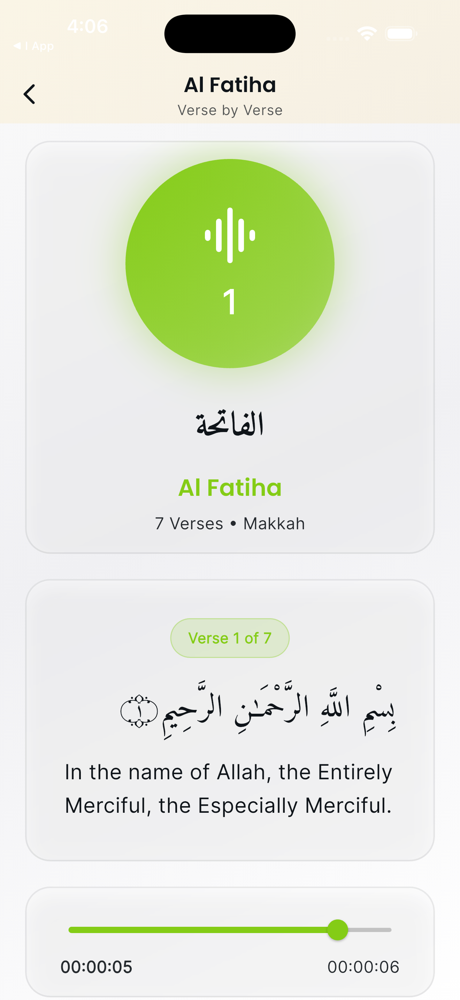
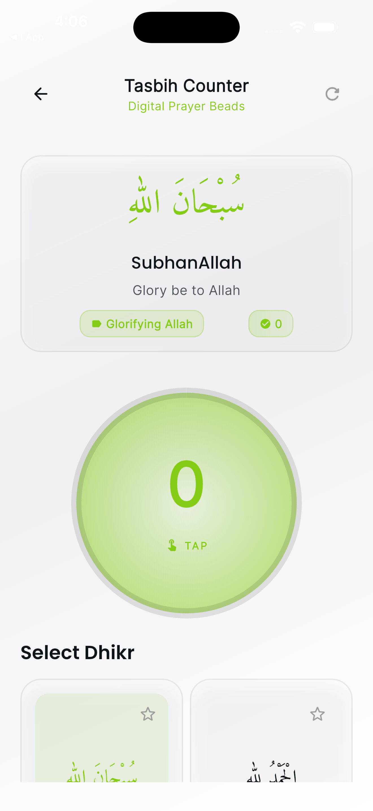
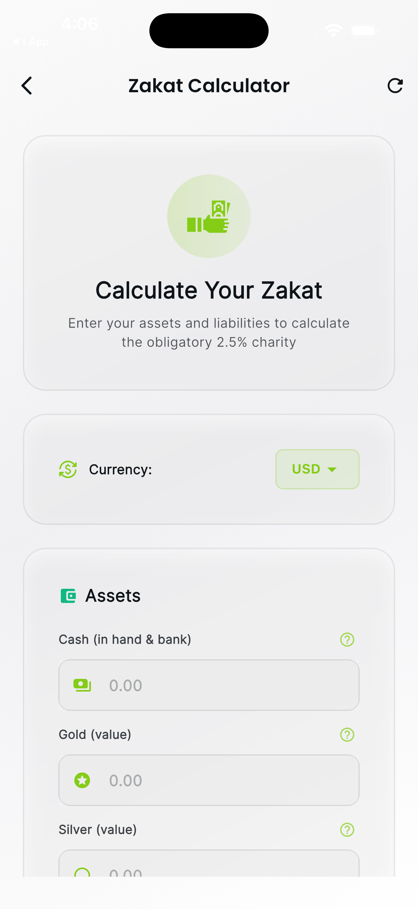
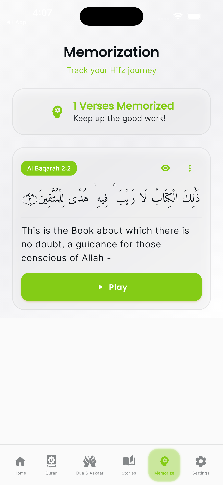

<div align="center">

**بِسْمِ اللهِ الرَّحْمٰنِ الرَّحِيْمِ**

*"Read! In the Name of your Lord, Who created"* - **Surah Al-Alaq (96:1)**

**May this app be beneficial in your journey of learning and understanding the Quran and Islamic teachings. 🌙**

<center><b>**Download Hidaya - Quran Learning App Now**</b></center> <br>
[Apple AppStore](https://apps.apple.com/pk/app/hidayah-quran-learning-app/id6755522997) <br>
[Download APK File](https://drive.google.com/drive/folders/1Evx71ay8_wjojFTTmhxfvTy4lOLEdQpZ)
</div>

# Hidayah - Comprehensive Islamic Learning Application 📖🕌

<div align="center">


</div>

A feature-rich, cross-platform Islamic learning application built with Flutter, featuring a premium **Liquid Glass UI** design. Hidayah provides an all-in-one platform for Quran reading with audio recitation, prayer times, Islamic stories, kids' learning modules, and spiritual growth tools.

<table>
  <tr>
    <td></td>
    <td></td>
    <td></td>
  </tr>
   <tr>
    <td></td>
    <td></td>
    <td></td>
  </tr>
   <tr>
    <td></td>
    <td></td>
    <td></td>
  </tr>
   <tr>
    <td></td>
    <td></td>
    <td></td>
  </tr>
 </table>
---

## 📑 Table of Contents

- [Highlights](#-highlights)
- [Screenshots](#-screenshots)
- [Features](#-features)
- [Packages Used](#-packages-used)
- [Getting Started](#-getting-started)
- [App Structure](#-app-structure)
- [Liquid Glass UI Design](#-liquid-glass-ui-design)
- [Main Sections](#-main-sections)
- [Development Notes](#-development-notes)
- [Assets Structure](#-assets-structure)
- [Key Technical Features](#-key-technical-features)
- [Download & Distribution](#-download--distribution)
- [Contributing](#-contributing)
- [License](#-license)

---

## 🌟 Highlights

🕋 **Complete Islamic Companion** - Everything you need for Islamic learning in one beautiful app  
📖 **Full Quran** - All 114 Surahs with audio recitation by multiple Qaris  
📚 **Islamic Stories** - Inspiring narratives from Islamic history  
🕌 **Prayer Times** - GPS-based accurate Salah timings with notifications  
🧭 **Qibla Finder** - Real-time compass for precise direction to Mecca  
🎨 **Premium UI** - Stunning Liquid Glass design with smooth animations  
👶 **Kids Learning** - Interactive Islamic education modules for children  
🆓 **100% Free** - No ads, no paywalls, all features available to everyone  

---

## 📸 Screenshots

> *Screenshots showcasing the beautiful Liquid Glass UI and comprehensive features will be added here.*

**Main Features Preview:**
- Home Dashboard with Prayer Times
- Quran Reading with Audio Player
- Islamic Stories Collection
- Qibla Finder with Real-time Compass
- 99 Names of Allah
- Kids Learning Modules
- Dua Collections & Tasbih Counter
- Memorization Tracker

---

## ✨ Features

### 📖 Quran Features

- **Complete Quran Access** - Browse all 114 Surahs with Arabic text using the `quran: ^1.4.1` package
- **Multi-Reciter Audio Player** - Listen to renowned Qaris with adjustable playback speed and repeat options
- **Multilingual Translations** - View translations in English, Urdu, and Bahasa Indonesia
- **Verse of the Day** - Daily featured verses with audio playback
- **Memorization Tracker** - Track and manage your Quran memorization progress
- **Manzil Recitation** - Access protective verses organized by traditional groupings
- **Quran Flashes** - Quick daily verse insights and reminders
- **Full Surah Player** - Continuous playback of complete Surahs with navigation
- **Search Functionality** - Find Surahs quickly by name or number

### 🎓 Learning & Education
- **Islamic Stories** - Inspiring narratives from Islamic history and traditions
- **99 Names of Allah** - Learn and explore the beautiful names and attributes of Allah with meanings

### 🕌 Prayer & Worship Tools

- **Prayer Times Calendar** - Accurate Salah timings based on GPS location using `adhan: ^2.0.0`
- **Hijri Calendar** - Islamic date display with Gregorian conversion using `hijri: ^3.0.0`
- **Prayer Notifications** - Optional reminders for each prayer time
- **Qibla Finder** - Real-time compass pointing to the Kaaba using `flutter_compass: ^0.8.0`
- **Digital Tasbih** - Electronic counter for Dhikr with customizable counts and colors
- **Dua Collections** - Comprehensive collection of daily prayers, morning/evening Azkar, and supplications
- **Zakat Calculator** - Calculate Zakat obligations for wealth, gold, silver, and savings

### ⚙️ Customization & Settings

- **Theme Modes** - Switch between light and dark modes
- **Glass Style Options** - Choose between Clear or Tinted glass effects
- **Accent Colors** - Select from multiple color themes (Gold, Teal, Blue, Purple, Pink, Green)
- **Font Size Adjustment** - Customize text size for comfortable reading
- **Prayer Notifications** - Configure reminders for Salah times using `flutter_local_notifications: ^17.2.3`
- **Multi-language Interface** - Interface support for English, Arabic, Urdu, and Bahasa Indonesia

### 🎨 UI/UX Features

- **Liquid Glass UI** - Premium translucent, frosted glass aesthetic
- **Glass Style Options** - Choose between Clear or Tinted glass themes
- **Responsive Design** - Beautiful layouts optimized for all screen sizes
- **Smooth Animations** - Fluid transitions with staggered effects
- **Intuitive Navigation** - Easy-to-use bottom navigation with 6 main sections
- **Shimmer Loading** - Elegant loading placeholders for better UX

## 📦 Packages Used

### Core Islamic Content
- **`quran: ^1.4.1`** - Source for all Arabic text, Surah names, and verse data
- **`adhan: ^2.0.0`** - Accurate prayer time calculations
- **`hijri: ^3.0.0`** - Hijri calendar conversion and Islamic dates

### State Management & Storage
- **`provider: ^6.1.1`** - State management solution
- **`hive: ^2.2.3`** & **`hive_flutter: ^1.1.0`** - Local NoSQL database for user data
- **`shared_preferences: ^2.2.2`** - User preferences and settings
- **`path_provider: ^2.1.2`** - File system paths for storing data

### Audio & Media
- **`just_audio: ^0.9.36`** - Audio playback for Quran recitations
- **`audio_session: ^0.1.18`** - Audio session management

### Location & Navigation
- **`geolocator: ^10.1.0`** - Device location for prayer times
- **`geocoding: ^2.1.1`** - Reverse geocoding for location names
- **`flutter_compass: ^0.8.0`** - Compass functionality for Qibla direction

### UI/UX Components
- **`google_fonts: ^6.1.0`** - Beautiful typography with Google Fonts
- **`flutter_svg: ^2.0.9`** - SVG image support
- **`flutter_islamic_icons: ^1.0.2`** - Islamic iconography
- **`flutter_staggered_animations: ^1.1.1`** - Smooth staggered animations
- **`shimmer: ^3.0.0`** - Shimmer loading effects

### Utilities
- **`intl: ^0.19.0`** - Internationalization and date formatting
- **`url_launcher: ^6.2.4`** - Launch external URLs and apps
- **`share_plus: ^12.0.1`** - Share content functionality
- **`translator: ^1.0.0`** - Translation services

### Notifications
- **`flutter_local_notifications: ^17.2.3`** - Local push notifications for prayer times
- **`timezone: ^0.9.2`** - Timezone support for notifications
- **`flutter_native_timezone: ^2.0.0`** - Native device timezone

### Support
- **`in_app_purchase: ^3.1.13`** - Voluntary donation feature

### Development Tools
- **`hive_generator: ^2.0.1`** - Code generation for Hive models
- **`build_runner: ^2.4.8`** - Build system for code generation
- **`flutter_launcher_icons: ^0.13.1`** - Automated app icon generation

## 🚀 Getting Started

### Prerequisites

- **Flutter SDK**: 3.8.1 or higher
- **Dart SDK**: 3.8.0 or higher (included with Flutter)
- **Platform Requirements**:
  - iOS: Xcode 14+ (for iOS development)
  - Android: Android Studio with SDK 21+ (for Android development)
- **Location Services**: Required for prayer times and Qibla finder
- **Internet Connection**: Required for initial audio downloads and translations

### Installation

1. **Clone the repository:**
   ```bash
   git clone <repository-url>
   cd i_app
   ```

2. **Install dependencies:**
   ```bash
   flutter pub get
   ```

3. **Generate required files (for Hive models):**
   ```bash
   flutter pub run build_runner build --delete-conflicting-outputs
   ```

4. **Generate app icons (optional):**
   ```bash
   flutter pub run flutter_launcher_icons
   ```

5. **Run the app:**
   ```bash
   flutter run
   ```

### Platform-Specific Setup

#### iOS
```bash
cd ios
pod install
cd ..
flutter run
```

#### Android
Ensure you have accepted Android licenses:
```bash
flutter doctor --android-licenses
flutter run
```

### First Launch

On the first launch, you'll see a welcome screen where you can:
- Select your preferred language (English, Urdu, Bahasa Indonesia, or Arabic)
- Learn about the app's features
- Get started with your Quran learning journey

## 📱 App Structure

```
lib/
├── constants/          # App-wide constants and themes
│   ├── app_constants.dart
│   ├── app_theme.dart
│   ├── dua_constants.dart
│   └── story_data.dart
├── models/            # Data models (Hive)
│   ├── user_progress.dart
│   └── user_progress.g.dart (generated)
├── providers/         # State management (Provider)
│   └── app_provider.dart
├── screens/           # All app screens
│   ├── welcome_screen.dart
│   ├── home_screen.dart
│   ├── quran_reading_screen.dart
│   ├── surah_detail_screen.dart
│   ├── audio_player_screen.dart
│   ├── full_surah_player_screen.dart
│   ├── manzil_screen.dart
│   ├── quran_flashes_screen.dart
│   ├── memorization_screen.dart
│   ├── islamic_stories_screen.dart
│   ├── kids_learning_screen.dart
│   ├── kids_modules/           # Children's learning modules
│   │   ├── juz_amma_screen.dart
│   │   ├── noorani_qaida_screen.dart
│   │   ├── writing_practice_screen.dart
│   │   ├── stories_screen.dart
│   │   ├── games_quizzes_screen.dart
│   │   └── rewards_screen.dart
│   ├── names_of_allah_screen.dart
│   ├── dua_screen.dart
│   ├── tasbih_screen.dart
│   ├── qibla_screen.dart
│   ├── zakat_calculator_screen.dart
│   ├── profile_screen.dart
│   ├── settings_screen.dart
│   ├── donation_screen.dart
│   └── support_app_screen.dart
├── widgets/           # Reusable UI components
│   ├── glass_card.dart
│   ├── prayer_calendar_widget.dart
│   ├── quick_actions_widget.dart
│   ├── quran_flashes_widget.dart
│   └── test_voice_dialog.dart
├── services/          # Business logic and external services
│   └── notification_service.dart
├── utils/             # Helper functions and utilities
│   ├── responsive_helper.dart
│   └── translation_helper.dart
└── main.dart          # App entry point
```

## 🎨 Liquid Glass UI Design

The app features a premium **Liquid Glass aesthetic** with:

- **Translucent Cards** - Frosted glass effect using `BackdropFilter`
- **Rounded Elements** - Deeply rounded corners for modern look
- **Gradient Backgrounds** - Rich, immersive color gradients
- **Smooth Animations** - Elegant scale and fade transitions
- **Glass Styles** - User-selectable Clear or Tinted glass effects
- **Multiple Color Themes** - Choose from 6 accent color options

### Default Color Palette

- **Primary Gold**: `#D4AF37` - Default accent color
- **Dark Background**: `#0A0E27` to `#16213E` gradient
- **Light Background**: Soft gradients for light mode
- **Text**: Adaptive colors for optimal readability
- **Glass Effects**: Semi-transparent overlays with backdrop blur

## 📚 Main Sections

### 1. 🏠 Home (Quran Reading)
- **All Surahs**: Browse all 114 Surahs with names in multiple languages
- **Surah Details**: View verses with Arabic text and translations
- **Verse of the Day**: Daily featured verses with audio playback
- **Featured Surahs**: Quick access to the 4 Quls (protective Surahs)
- **Prayer Times Widget**: Live prayer times with Hijri calendar
- **Quick Actions**: Fast navigation to popular features
- **Quran Flashes**: Daily verse insights carousel

### 2. 📖 Manzil (Protected Verses)
- **Traditional Groupings**: Seven Manzils for daily recitation
- **Arabic Text**: Complete verses in Arabic
- **Translations**: English translations for understanding
- **Protection Verses**: Verses traditionally recited for spiritual protection

### 3. 🤲 Dua & Azkar
- **Morning Azkar**: Prayers and supplications for the morning
- **Evening Azkar**: Prayers and supplications for the evening
- **Daily Duas**: Comprehensive collection of daily supplications
- **Categorized Duas**: Organized by occasions and needs
- **Arabic with Translation**: Arabic text with English meanings

### 4. 📚 Islamic Stories
- **Prophetic Stories**: Narratives from the lives of Prophets
- **Companions Stories**: Inspiring accounts from the Sahabah
- **Historical Events**: Important events in Islamic history
- **Moral Lessons**: Stories with valuable life lessons
- **Full Descriptions**: Detailed narratives with key takeaways

### 5. 🧠 Memorization
- **Track Progress**: Monitor your Quran memorization journey
- **Add Verses**: Select Surahs and verses to memorize
- **Progress Status**: Mark verses as learning, reviewing, or mastered
- **Notes**: Add personal notes for each memorization entry
- **Visual Tracking**: Progress indicators and statistics

### 6. ⚙️ Settings & Features
- **Prayer Times**: Live Salah timings with location-based calculation
- **Qibla Compass**: Find the direction to Mecca anywhere
- **99 Names of Allah**: Beautiful names with meanings and descriptions
- **Digital Tasbih**: Customizable Dhikr counter
- **Zakat Calculator**: Calculate your Zakat obligations
- **Kids Learning**: Interactive modules for children including:
  - Juz Amma learning
  - Noorani Qaida basics
  - Arabic writing practice
  - Islamic stories for kids
  - Educational games and quizzes
  - Achievement rewards
- **Theme Customization**: Dark/Light mode, glass styles, accent colors
- **Font Size**: Adjust text size for comfort
- **Prayer Notifications**: Configure prayer time reminders
- **Share App**: Share with friends and family
- **Support**: Voluntary donation options

## 🔧 Development Notes

### Location Permissions

The app requires location permissions for:
- **Prayer Times**: GPS-based calculation for accurate Salah timings
- **Qibla Direction**: Real-time compass orientation

Configure permissions in:
- **iOS**: `ios/Runner/Info.plist` - Location usage descriptions
- **Android**: `android/app/src/main/AndroidManifest.xml` - Location permissions

### Notification Setup

Prayer time notifications require platform-specific configuration:
- **iOS**: Enable push notifications capability in Xcode
- **Android**: Configure notification channels in `AndroidManifest.xml`

### Audio Sources

The app uses online audio sources for Quran recitations:
- API endpoints configured in `app_constants.dart`
- Multiple Qari options with different recitation styles
- Supports verse-by-verse and full Surah playback

### Data Storage

The app uses a multi-layer storage approach:
- **Hive**: NoSQL database for user progress, bookmarks, and memorization data
- **SharedPreferences**: User settings and preferences
- **Path Provider**: File system for audio caching

### Building for Production

Generate release builds:

**Android APK:**
```bash
flutter build apk --release
```

**Android App Bundle:**
```bash
flutter build appbundle --release
```

**iOS:**
```bash
flutter build ios --release
```

### Code Generation

After modifying Hive models, regenerate type adapters:
```bash
flutter pub run build_runner build --delete-conflicting-outputs
```

## � Assets Structure

The app uses organized asset folders:

```
assets/
├── audio/
│   ├── tajweed/        # Tajweed lesson audio files
│   └── qaris/          # Quran recitation audio (cached)
├── images/             # App images and illustrations
├── data/               # Local JSON data files
└── books/              # Islamic book resources
```

## 🔑 Key Technical Features

### State Management
- **Provider Pattern**: Centralized app state management
- **Hive Database**: Fast, lightweight NoSQL storage
- **Real-time Updates**: Reactive UI updates across screens

### Performance Optimizations
- **Lazy Loading**: Efficient loading of Quran text and audio
- **Shimmer Effects**: Smooth loading placeholders
- **Staggered Animations**: Optimized list animations
- **Audio Caching**: Local storage for frequently played recitations

### Accessibility
- **Multiple Languages**: Full RTL support for Arabic and Urdu
- **Font Scaling**: Adjustable text sizes
- **High Contrast**: Glass UI with readable color schemes
- **Audio Support**: Complete audio recitation for all content

## �� Free & Ad-Free

Hidayah is completely **free and ad-free**. The app is supported by voluntary donations through the "Support the App" feature. Donations do not unlock any additional features - all content remains accessible to everyone.

## � Download & Distribution

### Version Information
- **Current Version**: 1.0.0+1
- **Minimum Android SDK**: 21 (Android 5.0 Lollipop)
- **Minimum iOS Version**: 12.0

### Build Outputs
- Android APK: `build/app/outputs/flutter-apk/app-release.apk`
- Android App Bundle: `build/app/outputs/bundle/release/app-release.aab`
- iOS Archive: Generated through Xcode

## 📄 License

### Open Source with Attribution

This project is open source and available for anyone to use, modify, and distribute for educational and non-commercial purposes. However, please note the following important requirements:

#### ⚠️ Required Modifications for App Store Publishing

**This app is already published on Google Play Store and Apple App Store.** If you want to publish your own version, you **MUST** make the following changes:

1. **Change the App Logo/Icon** 
   - Create your own unique app icon
   - Do not use the original "Hidayah" branding
   - Update: `assets/logo.png` and run `flutter pub run flutter_launcher_icons`

2. **Modify the UI Design**
   - Customize colors, themes, and visual elements
   - Create your own distinct visual identity
   - Ensure your design differs from the published version

3. **Change App Name & Bundle Identifier**
   - Use a different app name in `pubspec.yaml`
   - Change the package name/bundle identifier:
     - iOS: Modify bundle identifier in Xcode
     - Android: Update `applicationId` in `android/app/build.gradle`

4. **Update Branding Elements**
   - Replace all branding assets in `assets/images/`
   - Modify splash screens and launch images
   - Update app metadata and descriptions

#### ✅ What You Can Do

- ✓ Use the source code for learning and educational purposes
- ✓ Fork and modify the codebase for your own projects
- ✓ Use the code as a reference for your own Islamic apps
- ✓ Contribute improvements back to this repository
- ✓ Deploy with your own unique branding and identity

#### ❌ What You Cannot Do

- ✗ Publish to app stores using the original "Hidayah" name and branding
- ✗ Copy the exact UI design and claim it as your own
- ✗ Use the original logo and assets in your published version
- ✗ Violate Google Play Store and Apple App Store policies regarding duplicate apps

#### 📜 Attribution

If you use this code, please provide attribution by:
- Mentioning this repository in your app's "About" or "Credits" section
- Keeping a reference to the original project in your documentation

This ensures compliance with app store policies and respects the original published application while allowing the community to benefit from the open-source code.

## 🤝 Contributing

While this is primarily an educational project, contributions are welcome! If you'd like to contribute:

1. Fork the repository
2. Create a feature branch (`git checkout -b feature/AmazingFeature`)
3. Commit your changes (`git commit -m 'Add some AmazingFeature'`)
4. Push to the branch (`git push origin feature/AmazingFeature`)
5. Open a Pull Request

### Areas for Contribution
- Translation improvements
- UI/UX enhancements
- Bug fixes
- Performance optimizations
- Documentation updates

## 📞 Support & Contact

For issues, questions, or suggestions:
- Create an issue in the repository
- Refer to Flutter documentation: [flutter.dev](https://flutter.dev)
- Package documentation on [pub.dev](https://pub.dev)

## 🌟 Acknowledgments

- **Quran Package**: Thanks to the maintainers of the `quran` package
- **Hadith Package**: `dorar_hadith` for comprehensive Hadith collections
- **Flutter Community**: For excellent packages and support
- **Islamic Scholars**: For making authentic knowledge accessible

---


